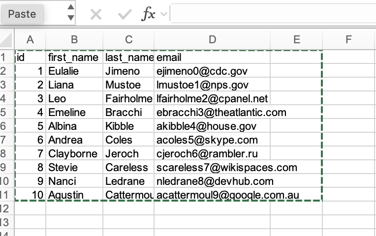

# grepxl

*A simple command-line search tool for excel spreadsheets*

## Installation

~~~
$ uv tool install grepxl
~~~

## Usage

Given an excel file `data.xlsx`:

to print a row where any one cell matches a regex

~~~
$ grepxl '.*' data/MOCKDATA.xlsx
┏━━━━┳━━━━━━━━━━━━┳━━━━━━━━━━━━┳━━━━━━━━━━━━━━━━━━━━━━━━━━━━┓
┃ id ┃ first_name ┃ last_name  ┃ email                      ┃
┡━━━━╇━━━━━━━━━━━━╇━━━━━━━━━━━━╇━━━━━━━━━━━━━━━━━━━━━━━━━━━━┩
│ 1  │ Eulalie    │ Jimeno     │ ejimeno0@cdc.gov           │
│ 2  │ Liana      │ Mustoe     │ lmustoe1@nps.gov           │
│ 3  │ Leo        │ Fairholme  │ lfairholme2@cpanel.net     │
│ 4  │ Emeline    │ Bracchi    │ ebracchi3@theatlantic.com  │
│ 5  │ Albina     │ Kibble     │ akibble4@house.gov         │
│ 6  │ Andrea     │ Coles      │ acoles5@skype.com          │
│ 7  │ Clayborne  │ Jeroch     │ cjeroch6@rambler.ru        │
│ 8  │ Stevie     │ Careless   │ scareless7@wikispaces.com  │
│ 9  │ Nanci      │ Ledrane    │ nledrane8@devhub.com       │
│ 10 │ Agustin    │ Cattermoul │ acattermoul9@google.com.au │
└────┴────────────┴────────────┴────────────────────────────┘
$ grepxl 'gov$' data/MOCKDATA.xlsx
┏━━━━┳━━━━━━━━━━━━┳━━━━━━━━━━━┳━━━━━━━━━━━━━━━━━━━━┓
┃ id ┃ first_name ┃ last_name ┃ email              ┃
┡━━━━╇━━━━━━━━━━━━╇━━━━━━━━━━━╇━━━━━━━━━━━━━━━━━━━━┩
│ 1  │ Eulalie    │ Jimeno    │ ejimeno0@cdc.gov   │
│ 2  │ Liana      │ Mustoe    │ lmustoe1@nps.gov   │
│ 5  │ Albina     │ Kibble    │ akibble4@house.gov │
└────┴────────────┴───────────┴────────────────────┘
$ grepxl '^Le' data/MOCKDATA.xlsx
┏━━━━┳━━━━━━━━━━━━┳━━━━━━━━━━━┳━━━━━━━━━━━━━━━━━━━━━━━━┓
┃ id ┃ first_name ┃ last_name ┃ email                  ┃
┡━━━━╇━━━━━━━━━━━━╇━━━━━━━━━━━╇━━━━━━━━━━━━━━━━━━━━━━━━┩
│ 3  │ Leo        │ Fairholme │ lfairholme2@cpanel.net │
│ 9  │ Nanci      │ Ledrane   │ nledrane8@devhub.com   │
└────┴────────────┴───────────┴────────────────────────┘
~~~
